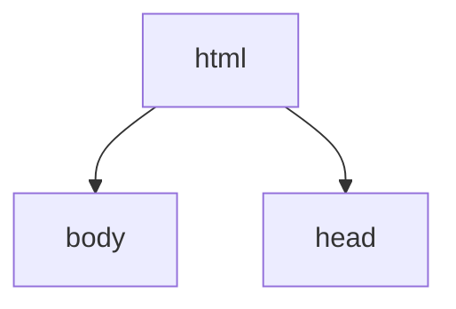
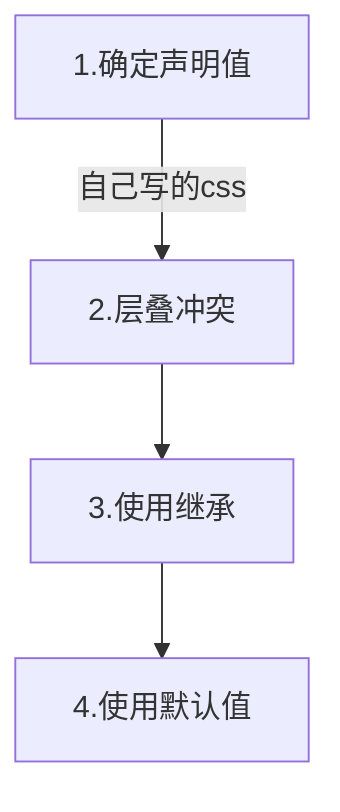

## 属性值计算过程

属性值计算过程：与二叉树一样，html,body，head...一个个元素进行渲染，顺序按照页面文档的树形结构进行。

渲染每个元素的前提条件：该元素的所有css属性必须有值 



**属性值计算过程：**一个元素，从所有属性都没有值，到所有属性都有值 

特殊的两个css取值：

```css
inherit//手动继承，将父元素的值取出应用到该元素
initial//初始值，将该属性设置为默认值
```

**属性值计算流程：**



1. 确定声明值,自己写的css属性
2. 自己写的css要与父级可以继承的css进行抵消，取自己写的css属性
3. 自己未定义属性，未确定的css就继承父级的，前提是该属性可以继承 
4. 自己未确定，该属性又不能继承。使用默认值

