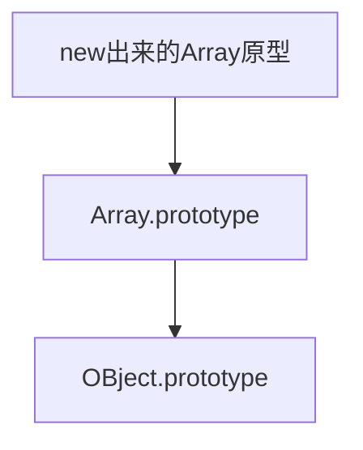

## 原型

每一个javaScript对象(null除外)都和另一个对象相关联，”另一个“就是原型，每个对象都从原型继承属性。

所有通过字面直接量创建的对象(`{}`)都具有一个原型对象。通过`Object.prototype`获得对原型对象的引用。

通过关键字`new`和构造函数创建的对象的原型就是构造函数的prototype属性的值

```js
new Object()//=>原型为  Object.prototype
new Array()//=>原型为  Array.prototype
new Date()//=>原型为   Date.prototype
```

没有原型的对象：`null,Object.prototype`

Object.prototype没有继承任何属性。其他原型对象(Array.prototype...)都是普通对象，普通对象都具有原型。所有内置构造函数(以及大部分自定义函数)都具有一个继承自Object.prototype的原型。例如Array.prototype的属性就是继承自Object.prototype,因此由`new Array()`创建的对象的属性继承自Array.prototype和Object.prototype。这一系列链接的原型对象就是”原型链“



```js
var arr = new Array();
console.log(arr.__proto__);//[]
console.log(arr.__proto__.__proto__);//{}
```

