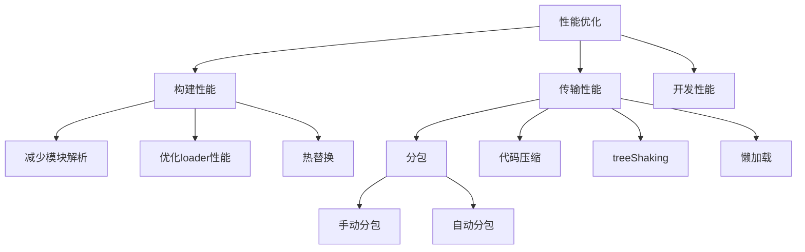

## 性能优化

从三个方面入手

1. 构建性能
2. 传输性能
3. 运行性能


* 构建性能

该处所说的构建性能，是指在开发阶段的构建性能，不是生产环境的构建性能，优化的目标，**是降低从打包开始，到代码效果呈现所经过的时间**

* 传输性能

指打包后的js代码传输到浏览器经过的时间

在优化传输性能时要考虑到：

1. 总传输量：所有需要传输的js文件的内容加起来，就是总传输量，重复代码越少，总传输量越少
2. 文件数量：当访问页面时，需要传输的js文件数量越多，http请求(三次握手，四次挥手)越多，响应的速度真慢
3. 浏览器缓存：js文件会被浏览器缓存，被缓存的文件不会在进行传输

* 运行性能

指js代码在浏览器端的运行速度

主要在于我们如何写出高性能的代码

## 优化思维导图




* 减少模块

**解析模块解析包括**：抽象语法树分析，依赖分析，模块语法替换

如果不解析模块的话（缩短构建时间），loader转换后的代码就是最终代码

**哪些模块不需要解析：**

模块中无其他依赖：第三方模块,例如jquery

**配置某个模块不解析**

配置`module.noParse`,它是一个正则，被正则匹配到的模块不会被解析

webpack.config.js

```js
module.exports = {
    mode:"development",
    modlue:{
        noParse:/jquery/
    }
}
```


* 热替换

> 热替换并不能降低构建时间(可能会稍微增加)，但可以降低代码改动到效果呈现的时间

使用`webpack-dev-server`时，考虑代码改动到效果呈现的过程

在打包后，浏览器会重新刷新请求==全部==资源

使用热替换后，流程发生变化 。浏览器只会请求==改动==的资源

**使用和原理**

```js
module.exports={
    devServer:{
        hot:true//开启热替换
    },
    plugins:[
        //可选
        new webpack.HotModuleReplacementPlugin()
    ]
}
```

2.更改代码

```js
//index.js //入口文件
if(module.hot){//是否开启热更新
    module.hot.accept()//接受热更新
}
```

* 自动分包 

关键在于配置一个分包策略

> webpack在内部是使用splitChunksPlugin插件进行分包

基本配置

webpack提供了`optinization`配置项，用于配置一些优化信息

其中`splitChunks`是分包策略的配置

```js
module.exports ={
    oplitChunks:{
        //分包策略
        chunks:all
    }
}
```

1.chunks

该配置用于配置需要应用倪策略的chunk

分包是从已有的chunk中分离出新的chunk，那么哪些chunk需要分离

chunks有三个值,分别是：

* all:对所有的chunk都要应用分包策略
* async：[默认]仅针对异步chunk应用分包策略
* initial：仅对普通chunk应用分包策略

所以，只需要配置`chunks`为`all`即可

2.maxSize

该配置可以控制最大字节数

如果某个包（分出来的包）超过了这个 值 ，则webpack会尽可能的将分离成多个包

分包的基本单位是**模块**，如果一个完整的模块超过这个体积，就不能在切割，因此可能包的体积会大于配置的值。

**分包的目的：提取大量的公共代码，从而减少总体积和充分利用浏览器缓存**


* 代码压缩

减少代码体积

**压缩工具**

Terser

**副作用**

如果一个函数没有副作用，同时，函数返回结果仅依赖参数，则该函数叫做**纯函数**

```js
function random(){
    var a = Math.random();
    return a;
}
//每次调用函数返回值都不一样，也不是纯函数 
random();
random();
```

副作用：函数运行过程中，可能会对外部环境造成影响

如果函数中包含以下代码，该函数叫做副作用函数：

* 异步代码
* localStorage
* 对外部数据的修改

```js
var num = 1;
function a(){//副作用函数，修改了外部数据 
    num = 2;
}
```

webpack自动集成Terser


* Tree shaking

> 压缩可以移除内部的无效代码
>
> tree shaking 可以移除模块之间的无效代码

背景

某些模块导出的代码并不一定会被用到

```js
//=>main.js
export function add(a,b){
    return a+b;
}
export function sun(a,b){
    return a+b
}
```

```js
//=>index.js
import {add} from "./main.js"
add(1,2)
```

类似上述模块，在导入某个模块时，运用了模块的某个函数，某些函数并没有被运用

tree shaking ：就是去除未运用的代码

**使用**

`webpack2`支持了`tree shaking`

只要是生产环境，`tree shaking`自动开启

在编写代码时，尽量：

* 使用`export xx`导出，而不使用`export default {xx}`导出
* 使用`import {xx} from "xx"`或`import * as xx from "xx"`导入，而不使用`impo xx from "xx"导入`

**使用第三方库**

某些第三方库可能使用的是`commonjs`方式导出，比如`lodash`

又或者没有提供普通的ES6方式导出

对于这些库，`tree shaking`无法发挥作用

因此要寻找这些库的ES6版本，很多流行的库进了发布了它的`es6`版本，比如`loadash-es`

